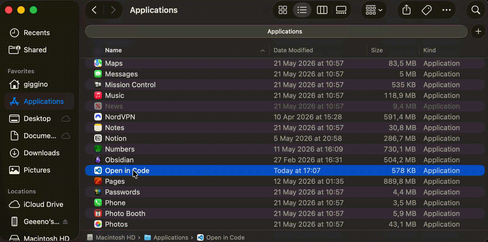

# Open in iTerm2

A lightweight macOS utility that opens the current Finder folder in iTerm2 with a single click from the Finder toolbar.

> The workflow is identical to [OpenInCode](https://github.com/luigi-borriello00/OpenInCode) — the GIFs below show the same process applied to VS Code, but the behavior is exactly the same with iTerm2.

<p align="center">
  
</p>

## Features

- One-click: opens the active Finder window's folder in iTerm2
- No windows, no Dock icon — runs entirely headless (`LSUIElement`)
- Universal binary: runs natively on both Intel and Apple Silicon Macs
- Zero dependencies beyond macOS Command Line Tools
- Minimal codebase (~30 lines of Swift)

## Requirements

- macOS 11.0 (Big Sur) or later
- [iTerm2](https://iterm2.com/) installed in `/Applications`
- Xcode Command Line Tools (`xcode-select --install`)

## Install

### Download (recommended)

1. Download `Open in iTerm2.app.zip` from the [latest release](https://github.com/luigi-borriello00/OpenInIterm2/releases/latest)
2. Unzip it
3. Hold `⌘` and drag `Open in iTerm2.app` into the Finder toolbar

<p align="center">
  
</p>

### Build from source

```bash
git clone https://github.com/luigi-borriello00/OpenInIterm2.git
cd OpenInIterm2
./build.sh
```

## Usage

Click the icon in the Finder toolbar — it opens the current Finder folder in iTerm2.

> **First launch:**
> 1. Right-click the app and select *Open* to bypass Gatekeeper.
> 2. macOS will ask permission for the app to control Finder — click *OK*.
> 3. If the permission dialog doesn't appear, go to *System Settings > Privacy & Security > Automation* and enable the toggle for "Open in iTerm2" under Finder.

## How It Works

1. macOS launches the app when clicked from the Finder toolbar
2. The app runs a short AppleScript to get the POSIX path of the frontmost Finder window (falls back to the Desktop if no window is open)
3. It invokes `/usr/bin/open -n -b com.googlecode.iterm2 <path>` to open the folder in iTerm2
4. The app exits immediately — no lingering processes, no Dock icon

## Uninstall

Drag the app icon out of the Finder toolbar (hold `⌘` and drag it away until you see the "poof" animation).

## Credits

Same concept as [OpenInCode](https://github.com/luigi-borriello00/OpenInCode), adapted for iTerm2.

## License

MIT
